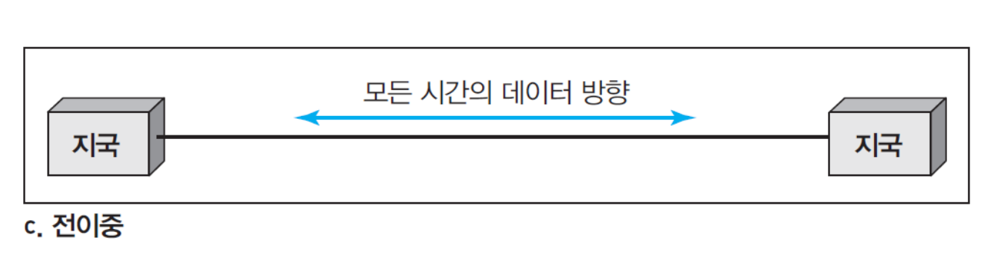

<br> 
<h1>Data Communication</h1>
<br>

#1  
1.1 데이터 통신  
1.2 네트워크  
1.3 인터넷  
1.4 프로토콜과 표준
 
<br><br>

**데이터 통신** : 특정의 전송매체 ( 꼬임쌍선, 광케이블 등 ) 를 통하여 두 장치간 이루어지는 데이터 교환

<br>

```
기본특성
- 전달 (delivery)
- 정확성 (accuracy)
- 적시성 (timeliness) : 적정 시간 내에 전달
- 파형 난조(jitter) : 음성이나 동영상 패킷 도착시간이 서로 일정치 못함
```

<br>

**구성요소**
- 메시지(Message) : 통신 대상인 전송되는 정보( 데이터 ), 정보는 문자, 숫자, 소리, 그림, 영상 또는 이들의 조합
- 송신자(Sender) 메세지를 보내는 장치
- 수신자(Receiver) : 메세지를 받는 장치
- 전송매체(Medium) : 메세지가 송신자에서 수신자까지 메세지를 전달하는 문리적인 경로(꼬임쌍선(twisted pair wire), 동축케이블(coaxial cable),
광케이블(fiber-optic cable), 레이저 또는 무선파)
- 프로토콜(Protocol) : 데이터 통신을 제어하는 규칙들의 집합
  


<br>

**데이터 표현**
- 문자 : 비트 패턴, 즉 0과 1로 된 비트들의 순차열로 표현
- 코드(code) : 부호를 표현하기 위한 비트 패턴들의 집합
- 코딩(coding) : 부호를 표현하는 과정
- ASCII : ANSI 표준 코드(7bit)
- 확장 ASCII : 8bit(부록 A 참조)
- 유니코드(Unicode) : 32 bit 사용. 전 세계 모든 문자 표현
- 숫자(number) : 비트 패턴을 사용하여 표현
- 화상(images) : 픽셀(pixel), 해상도(resolution)
- 음성 : 연속 신호(소리나 음악)
- 동영상 : 연속적인 개체 또는 여러 화상의 조합


<br>
<br>


**데이터 전송방식**
- 단방향 방식(simplex mode)
  - 한 방향으로만 통신이 가능
  - 한 지국은 송신, 다른 한 지국은 수신만
  - ex : 자판, 모니터


<br>

- 반이중 방식(half-duplex mode)
  - 각 지국은 송,수신 가능
  - 각 지국 간 동시에 수신 불가
  - ex : 워키토키, 민간 방송용 라디오


<br>

- 전이중 방식(full-duplex mode)
  - 양쪽 지국 간 동시에 송,수신 가능
  - 양방향으로 통행이 가능한 2차선 도로와 같음
  - 신호는 링크의 용량을 공유해서 양방향으로 전달
  - ex : 전화



<br>
<br>


**네트워크**  
전송매체의 연결된 노드와 링크의 집합  

노드 : 네트워크상의 다른 노드로 데이터 전송,수신 할 수 있는 모든 장치  
링크 : 장치들을 서로 연결하는 통신 채널  

```
네트워크 평가기준
- 성능(Performance) :  전달시간, 응답시간 등 여러가지 방법으로 측정
- 신뢰도(Reliability) : 고장 빈도수, 복수 소요시간, 재난
- 보안(Security) : 불법적인 접근, 바이러스
```

<br>
<br>


**분산처리(Distributed processing)**  
많은 작업을 여러대의 컴퓨터에 나누어서 수행  
<br>


장점 
- 분산 데이터베이스(Distributed databases)
  - 하나의 시스템이 전체 DB 를 위한 저장 공간을 제공 할 필요 없다

- 빠른 문제해결 : 한 문제 분산해서 해결
- 보안/캡슐화 : 시스템 설계자는 이용자에 대해 내용 제한 가능
- 중복에 의한 안전 : 같은 시간에 같은 프로긂을 여러대의 컴퓨터에 실행시 중복에 의한 안전 확보 가능
- 공동 작업 : 여러대의 컴퓨터, 사용자가 협동 가능


<br>
<br>


**물리적인 구조 : 연결유형**  

점-대-점 회선구성(point-to-point line configuration)
- 채널의 전체 용량은 두 기간의 전송을 위해 사용
- 케이블이나 전선, 극초단파나 인공위성 연결과 같은 방식도 가능
- 텔레비전 채널을 바꿀 때 사용하는 적외선 리모컨


다중점(multipoint, 멀티드롭(multidrop))
- 3개 이상의 특정 기기가 하나의 링크를 공유
- 채널의 용량을 공간적으로 또는 시간적으로 공유


<br>
<br>


**물리적인 구조 : 접속형태(topology)**  

그물형(Mesh)
- 모든 장치는 다른 장치와 점-대-점 링크
- n개의 장치를 연결하기 위해 n(n-1)/2개의 채널 요구
- n-1 개의 입출력 포트

   장점
   - 원활한 자료 전송 보장 : 점-대-점 전용 링크 제공
   - 높은 안정성
   - 비밀 유지와 보안
   - 결함 식별과 분리가 비교적 용이
   
   단점
   - 케이블의 양과 요구되는 I/O의 포트 수
   - 설치와 재구성의 어려움


<br>
<br>

성형 (STAR)
- 허브 라는 중앙제어장치와 전용 점-대-점 링크 구성
- 각 장치간 직접적인 통신 불가
- 모든 전송은 제어 장치를 통해 전송
- 1 개의 채널
- 1개의 I/O 포트가 요구

   장점
   - 그물형 접속형태보다 적은 비용
   - 설치와 재구성이 용이
   
   단점
   - 허브 고장시 전체 고장


<br>
<br>

버스형(BUS)
- 다중점 형태
- 탭과 유도선에 의해 버스 연결

   장점
   - 설치가 쉽다
   - 가장 적은 케이블 사용

   단점
   - 재구성, 결함 분리 어려움
   - 중추 케이블의 결함시 다수의 장치에 영향을 줌


<br>
<br>

링형(RING)
- 자신의 양 옆 장치와 전용 점-대-점 회선구성
- 각 자치는 중계기(repeater) 포함

   장점
   - 설치와 재구성이 쉽다
   - 신호는 항상 순환
   - 경보 ( 일정 시간 내 신호가 수신되지 않을 시 위치 경보 ) 사용

   단점 : 링의 결함시 전체 네트워크 마비  
   해결책 : 이중링, 결함지점의 단점 스위치 사용


혼합형(Hybrid)


<br>
<br>

네트워크 모델  
네트워크 분류  
LAN(Local Area Network, 근거리 통신망)
- 사무실, 빌딩, 대학에서 사용하는 기기들의 연결


WAN(Wide Area Network, 광역 통신망)
- 국가, 대륙 또는 전세계를 포괄하는 광대역영역에 데이터, 음성 등 정보의 장거리 전송 제공
- 거리 제한 없음
- 통신 회사가 임대를 목적으로 만들어 사용


MAN(Metropolitan Area Network, 도시 통신망)
- 도시 전체를 수용하도록 확장 설계


PAN(Personal Area Network, 개인 영역 통신망)
- 10m 안팎의 개인 영역 내에 위치한 정보 기술 장치들 간의 상호통신


BAN(Body Area Network, 신체 통신망) 
- 몸 속(in-body), 몸 위(on-body), 몸 주위(off-body)에 있는 기기들 사이의 통신 및 통신망


<br>

```
네트워크간 네트워크  
네크워크 상호 연결 장치(라우터, router)를 이용한 네트워크간 연결
```


- internet : 네트워크들을 상호 연결한 네트워크 총칭
- Internet : 전세계적으로 널리 사용되고 있는 TCP/IP를 사용하고 있는 특정 네트워크


<br>
<br>

```
인터넷 역사 
1972년 Vint Cerf와 Bob Kahn은 네트워크를 통하여 패킷을 전송하는 중계 하드웨어 역할을 하는 게이트웨이 (Gateway) 개발
```
<br>
<br>

TCP/IP
- 1973년 종단-대-종단 패킷 전달을 위한 프로토콜제안
- 1977년 인터넷 시연(ARPANET, 패킷라디오, 패킷위성)
- 네트워크간 연결 프로토콜을 TCP/IP로 부르기 시작
- 1981년 UNIX 운영체제에 TCP/IP 포함 배포
- TCP/IP가 ARPANET의 공식적인 프로토콜이 됨
  
<br>

오늘날의 인터넷  
모든 사용자는 인터넷 서비스 제공자(InternetService Provider, ISP)  이용


<br>

- 국제(international) 인터넷 서비스 제공자
- 국가(national) 인터넷 서비스 제공자
- 지구(regional) 인터넷 서비스 제공자
- 지역(local) 인터넷 서비스 제공자

<br>
<br>

프로토콜(Protocol)
- 개체간에 이루어지는 데이터 통신을 제어하는 규칙들의 집합

<br>

프로토콜 주요요소
- 구문(Syntax)
- "무엇을"에 해당, 데이터 구조와 형식, 부호화, 크기
- 무엇을 어떤 순서로 전송할 것인가에 관한 내용

- 의미
- " 어떻게"에 해당
- 데이터 형태에 대해 어떻게 해석하고, 어떤 동작을 취할 것인가?
- 타이밍
- "언제"에 해당
- 수신자와 송신자간의 데이터 전송 시간과 속도 조절

<br>

표준(Standard)
- 통신기기 시장을 개방적이고 경쟁적으로 만들기 위한 관리 문서
- 국제 또는 국내의 데이터 통신 기술 및 처리에 대한 호환성 보장

<br>

법률표준(by law standard)
- 공식적으로 공인된 기관에 의해 입법화된 표준

<br>

사실표준(by fact standard)
- 신제품이나 신기술의 기능을 규정한 제조업체에 의해 제정된 표준
- 특허(proprietary) 또는 폐쇄(closed) 표준
   - 영리 기관이 자사 제품의 기본 원리를 창안한 것으로 독점적 권리 소유
- 비특허(non-proprietary) 또는 개방(open) 표준
   - 집단이나 위원회에서 개발하여  공개한 표준

