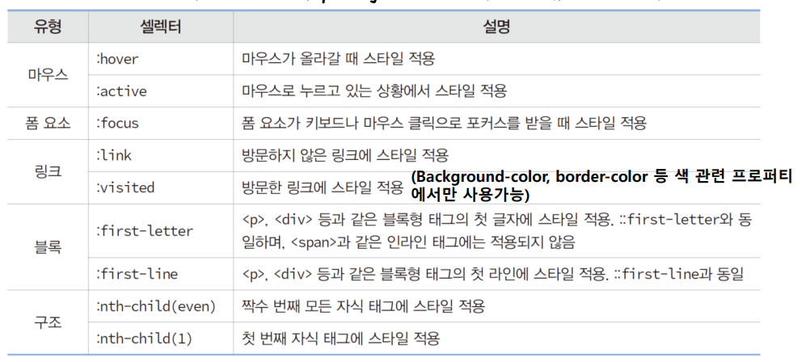

<br> 
<h1>CSS</h1>
<br>

#1

<br>

**CSS의 기능**
- 색상과 배경
- 텍스트
- 폰트
- 박스 모델
- 비주얼 포맷 및 효과
- 리스트
- 테이블

<br>

**CSS3 스타일 시트 구성**  
- 셀렉터 ( 선택자 ) : css 스타일 시트를 html 페이지에 적용하도록 만든 이름
- 프로퍼티 ( 속성 ) : 스타일 속성 이름, 약 200개 존재
- 값 : 프로퍼티의 값
- 주석문 : 스타일 시트 내에 붙이는 설명문 /* */
- 대소문자 구분 없음 


<br><br>

**html 문서에 css3 스타일 시트 만드는 방법 3가지**
1. <style></style> 태그에 스타일 시트 작성
2. html 태그의 style 속성에 스타일 시트 작성
3. 스타일 시트를 별도 파일로 작성
   - link 태그나 @import로 불러서 사용
   - link 태그는 head 에서만 사용 <link herf="text.css" type="text/css" rel="stylesheet">
   - @import 문은 style 안에서만 사용되면 여러번 사용가능
    - @import url(style.css); @import url('style.css'); @import "style.css" 다 가능
    - 
특징
- style 태그는 head 태그 내에서만 사용
- style 태그는 여러번 작성 가능


<br><br>

**html 태그 style 속성에 css 스타일 시트 작성**  


<br><br>

**스타일 상속**  
css 스타일은 부모 태그로부터 상속
- 부모태그 ( 부모 요소 ) : 자신을 둘러싸는 태그

```html
<p style="color:green">안녕하세요
    <em style=“font-size:25px”>자식입니다</em>
</p>
```
- p 태그는 em 의 부모태그, em 의 출력은 폰트 25px; 글자색은 p 태그의 상속을 받아 green
- em 태그 : 강조 하는 인라인 태그

<br>

**블록태그** : 자신만의 공간을 가지고 있는 태그
- 글상자 역할 또는 공간의 역할 담당 div
- 단락의 역할 p
- p 태그와 같지만 목차의 속성을 가지고 있는 h1~h6

<br>

**인라인 태그** : 반드시 블록 태그 안에 사용 되어야 함, 상자 안에 존재하는 내용물과 같아 상자 같은 보장이 없기에 단독으로 쓰이면 내용이 망가짐
- br, img, a ...
- span 태그
  - 아무 속성이 없어 단독으로 사용할 경우 문단에 아무 영향을 주지 않음
  - 문단 내 특정 단어나 문장에 스타일을 변경해야 할 때 사용
  - 주로 css 에서 정의한 속성으로 문서를 꾸밀 때 사용

<br><br>

**CSS3 규칙** - 스타일 합치기와 오버라이딩
- 태그에 적용 가능한 스타일
  - 브라우저의 디폴트 스타일
  - 스타일 시트 파일에 선언된 스타일
  - style 태그에 선언된 스타일
  - style 속성에 선언된 스타일
- 스타일 합치기(cascading) 와 오버라이딩(overriding) 이란?
  - 태그에 적용되는 모든 스타일이 합쳐지고, 동일한 스타일은 순위가 높은 스타일이 우선 적용되는 규칙

<br>

**우선순위**
1. hthml 안에 style 속성
2. style 태그
3. external.css (  )
4. 브라우저 디폴트 스타일 ( html 태그 자체에 style 에서 속성 적용)


<br><br>

**셀렉터** : html 태그의 모양을 꾸밀 스타일 시트를 선택하는 기능
태그 이름 셀렉터
- 태그이름이 셀렉터로 사용되는 유형
- 셀렉터와 같은 이름의 모든 태그의 스타일 시트 적용 

```html
<style>
h3, li{
    color: brown; 
}
</style>

<h3> 제목 </h3>
<ul>
    <li></li>
</ul>

<!-- h3 과 li 태그에 컬러 브라운 들어감. -->
```

**class 셀렉터**  
- 점(.)으로 시작하는 이름의 셀렉터
- html 태그의 class 속성으로만 지정 가능
- 적합한 활용
  - 여러 태그를 하나의 그룹으로 묶어 단체로 동일한 스타일을 적용할 때
  - class 속성값이 같은 태그에 모두 css 스타일 적용
- 태그의 종류에 관계 없이 class 셀렉터 활용가능

<br>

**id  셀렉터**
- (#) 으로 시작하는 이름의 셀렉터
- html 태그의 id 속성으로만 지정가능
- id 속성의 목적은 각 태그를 유일하게 구분
  - 동일한 id 속성이 같지 않도록 html 파일 작성하는 것이 바람직
  - js 코드에서 id 값으 가진 객체를 찾을 때 문제됨
- 적합한 활용 : id 셀렉터는 여러 태그 중 특정 태그에만 css 스타일을 적용할 때 적합

<br>

**셀렉터 조합하기**
- 자식 셀렉터 : 부모 자식 관계인 두 셀렉터럴 '>' 기호로 조합 div > strong { color: black; }
- 자손 셀렉터 : 자손 관계인 2개 이상의 태그 나열 ul strong { color: black; }


<br><br>


- 전체셀렉터 : (*) 문자를 사용하여 모든 태그에 적용시키는 셀렉터 / * { color ...}
- 속성 셀렉터 : html 태ㅐ그의 특정 속성에 대해 값이 일하는 태그에만 스타일을 적용 / input[type=text]
- 가상 클래스 셀렉터 : 어떤 조건이나 상황에서 스타일을 적용하도록 만든 셀렉터
- 40개 이상의 많은 가상 클래스 셀렉터 존재



```html
<style>
    h3,li { /* 태그 이름 셀렉터 */
        color: brown;
    }
    div>div>strong { /* 자식 셀렉터 */
        background: yellow;
    }
    ul strong { /* 자손 셀렉터 */
        color: dodgerblue;
    }
    .warning { /* class 셀렉터 */
        color: red;
    }
    body.main { /* class 셀렉터 */
        background: aliceblue;
    }
    #list { /* id 셀렉터 */
        background: mistyrose;
    }
    #list span { /* 자손 셀렉터 */
        color: forestgreen;
    }
    h3:first-letter { /* 가상 클래스 셀렉터 */
        color: red;
    }
    li:hover { /* 가상 클래스 셀렉터 */
        background: yellowgreen;
    }
</style>

<div>
    <div>2학기 <strong>학습내용</strong> 입니다</div>
    <ul>
        <li><span>HTML5</span></li>
        <li><strong>CSS</strong></li>
        <li>JS</li>
    </ul>
    <div class="warning">60 점 이하는 F</div>
</div>
```

<br><br>

**CSS 에서 색 표현**
1. 16 진수 코드로 표현 #000000
2. 10진수 코드와 rgb() 로 표현 rgb(000,000,000)
3. 색 이름으로 표현, css 표준에서는 140개의 색 이름을 정하고 있음

color: 색 / html 태그의 텍스트 글자색
background-color: 색 / html 태그의 배경 색
border-color: 색 / html 태그의 테두리 색

<br>

**텍스트 꾸미는 css3 스타일 시트**  
text-indent: length , percentage / 들여쓰기  
text-align: left, right, center, justify / 정렬  
text-decoration: none, underline, overline, line-throuht / 텍스트 꾸미기

<br>

**폰트 제어**  
- 폰트 패밀리 , font-family : 폰트, 폰트없는경우, 2번째도 없는 경우
- 폰트 크기, font-size
- 폰트 스타일, font-style
- 폰트 굵기, font-weight

```html
<style>
  p {
  font: normal 16px/1.5 Arial, sans-serif;
}
  /* font: font-style font-weight font-size font-family */
</style>
```

<br><br>

**css3의 표준 단위**


<br><br>

**CSS3 의 박스 모델**   
HTML 태그는 사각형 박스로 다루어진다
- 각 HTML 태그 요소를 하나의 박스로 다룸
- 박스 크기, 배경 색, 여백, 옆 박스와의 거리 등 제어
  
<br>

**박스 모델의 구성**  
- 콘텐츠 : HTML 태그의 텍스트나 이미지가 출력되는 부분
- 패딩(padding) : 콘텐츠를 직접 둘러싸고 있는 내부 여백
- 테두리(border) : 패딩 외부의 테두리, 직선 점선 혹은 이미지로 테두리 가능
- 여백(margin) : 박스 맨 바깥 영역이며 테두리 바깥 공간으로 인접한 아래위 이웃 태그의 박스와의 거리


<br><br>

**다양한 선 스타일**
- solid : 직선
- none / hidden : 선 없음
- dotted : . . . . 
- dashed : - - - - 
- double : 두 줄
- groove : 내부 그림자 각짐
- ridge : 외부 그림자 각짐
- inset : 내부 그림자
- outset : 외부 그림자

<br>

**둥근 모서리 테두리 만들기**


<br>

**이미지 테두리 만들기**
- 모서리와 에지로 구분하여 각각 이미지 입힘
- border-width 과 border-style 역시 미리 지정 필요


<br>

**배경 다루기**
- 색 이미지 지정, background-color, background-image
- 이미지 위치,  background-position
- 이미지 반복 출력, background-repeat : repeat-y, repeat-x

<br>

**background 단축 프로퍼티**
```html
<style>
.element {
  background: #fff url('background.jpg') no-repeat center center;
   /* background-color, background-image, background-repeat, background-position  */
}
<style>
```

<br>

**text-shadow 프로퍼티**
```html
<style>
  h1 {
  text-shadow: 2px 2px 4px #000000;
}
/* text-shadow: x-offset y-offset blur color; */
</style>
```

<br>

**box-shadow 프로퍼티**
```html
<style>
  h1 {
  box-shadow: 2px 2px 5px 1px #999999;
}
/* box-shadow: x-offset y-offset blur spread color; */
</style>
```

<br>

**마우스 커서 제어**

```html
<p style="cursor: crosshair">십자 모양 커서</p>
<p style="cursor: help">도움말 모양 커서</p>
<p style="cursor: pointer">포인터 모양 커서</p>
<p style="cursor: progress">프로그램 실행 중 모양 커서</p>
<p style="cursor: n-resize">상하 크기 조절 모양 커서</p>
```

<br>

