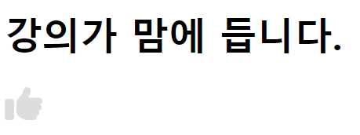
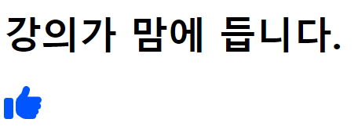
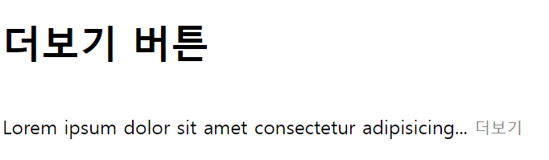
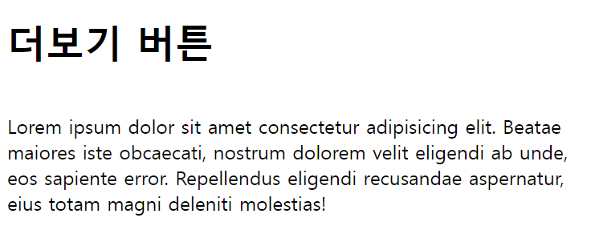
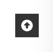
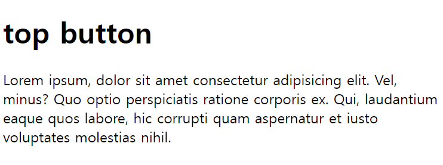
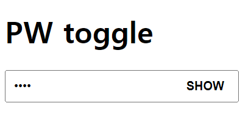
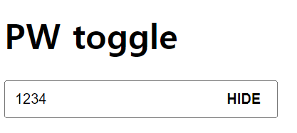

<br> 
<h1>JavaScript</h1>
<br>

#7  
예제 

<br>

**1. classList.toggle()**
```html
<h1> 강의가 맘에 듭니다. </h1>

<style>
    #btn{
        width: 2rem;
        cursor: pointer;
        fill: #ddd;
        }
    #btn.active{
        fill: #05f;
    }

</style>

<svg id="btn" xmlns="http://www.w3.org/2000/svg" viewBox="0 0 512 512">
    <path
        d="M313.4 32.9c26 5.2 42.9 30.5 37.7 56.5l-2.3 11.4c-5.3 26.7-15.1 52.1-28.8 75.2H464c26.5 0 48 21.5 48 48c0 18.5-10.5 34.6-25.9 42.6C497 275.4 504 288.9 504 304c0 23.4-16.8 42.9-38.9 47.1c4.4 7.3 6.9 15.8 6.9 24.9c0 21.3-13.9 39.4-33.1 45.6c.7 3.3 1.1 6.8 1.1 10.4c0 26.5-21.5 48-48 48H294.5c-19 0-37.5-5.6-53.3-16.1l-38.5-25.7C176 420.4 160 390.4 160 358.3V320 272 247.1c0-29.2 13.3-56.7 36-75l7.4-5.9c26.5-21.2 44.6-51 51.2-84.2l2.3-11.4c5.2-26 30.5-42.9 56.5-37.7zM32 192H96c17.7 0 32 14.3 32 32V448c0 17.7-14.3 32-32 32H32c-17.7 0-32-14.3-32-32V224c0-17.7 14.3-32 32-32z" />
</svg>

<script>
    var btn = document.getElementById('btn');
    btn.addEventListener('click', () => {
        // classList.toggle() 클래스있으면 빼고 없으면 추가한다.
        btn.classList.toggle('active');
    });
</script>
```
<div>


</dvi>

<br><br>

**2. classList.add()**
```html
<h1> 더보기 버튼 </h1>

<style>
    #con {
        display: inline-block;
    }
    #btn {
        border: none;
        cursor: pointer;
        background-color: transparent;
        color: #888;
        padding: 0;
    }
    #btn.hidden {
        display: none;
    }
 </style>

<p id="con">Lorem ipsum dolor sit amet consectetur adipisicing elit. Beatae maiores iste obcaecati, nostrum dolorem
        velit
        eligendi ab unde, eos sapiente error. Repellendus eligendi recusandae aspernatur, eius totam magni deleniti
        molestias!</p>

<button id="btn"> 더보기 </button>

<script>
    var btn = document.getElementById('btn');
    var con = document.getElementById('con');
       
    var fullcon = con.textContent; 
    var lesscon = fullcon.substring(0,50)+"...";
    // substring 문자열 추출 메소드, 인덱스 0~50 까지

    console.log(fullcon); // 전체 출력
    console.log(lesscon); // 50자 까지만 출력

    // 페이지가 처음 로드 되었을 때 lesscon 만 보이게
    con.textContent = lesscon;

    btn.addEventListener('click', () =>{
        con.textContent = fullcon;
        // 더보기 버튼을 사라지게 한다.
        btn.classList.add('hidden');
    })
</script>
```



<br><br>

**3. document.documentElement.scroll**
```html
<style>
    html { 
        scroll-behavior: smooth;
    }
    body {
        min-height: 2000px;
    }

    #btn {
        position: fixed;
        bottom: 2rem;
        right: 2rem;
        width: 2rem;
        height: 2rem;
        display: flex;
        justify-content: center;
        align-items: center;
        border: none;
        background-color: #333;
        cursor: pointer;
    }

    #up {
        width: 1rem;
        fill: #fff;
    }

    .invisible {
        visibility: hidden;
    }
</style>


<h1> top button </h1>

<p> Lorem ipsum, dolor sit amet consectetur adipisicing elit. Vel, minus? Quo optio perspiciatis ratione
    corporis
    ex. Qui, laudantium eaque quos labore, hic corrupti quam aspernatur et iusto voluptates molestias nihil.</p>


<button id="btn" class="invisible">
    <svg id="up" xmlns="http://www.w3.org/2000/svg" viewBox="0 0 512 512">
        <path
            d="M256 512A256 256 0 1 0 256 0a256 256 0 1 0 0 512zM135.1 217.4l107.1-99.9c3.8-3.5 8.7-5.5 13.8-5.5s10.1 2 13.8 5.5l107.1 99.9c4.5 4.2 7.1 10.1 7.1 16.3c0 12.3-10 22.3-22.3 22.3H304v96c0 17.7-14.3 32-32 32H240c-17.7 0-32-14.3-32-32V256H150.3C138 256 128 246 128 233.7c0-6.2 2.6-12.1 7.1-16.3z" />
    </svg>
</button>


<script>
    var btn = document.getElementById('btn');
    window.addEventListener('scroll', () => {
        console.log(document.documentElement.scrollTop);

        if (document.documentElement.scrollTop < 200) {
            btn.classList.add('invisible');

        } else {
            btn.classList.remove('invisible');
        }

    })

    btn.addEventListener('click', () => {
        document.documentElement.scrollTop = 0;
    })
</script>
```
 >


<br><br>

**4. attribute 업데이트**
```html
<style>
    #con {
        position: relative;
        width: 16rem;
    }

    #input {
        padding: 0.5rem;
        width: 100%;
        box-sizing: border-box;
    }

    #btn {
        position: absolute;
        top: 0;
        right: 0;
        border: none;
        background-color: transparent;
        height: 100%;
        padding: 0 1rem;
        font-weight: 600;
        cursor: pointer;
    }
</style>

<h1> PW toggle </h1>
<div id="con">
    <input type="password" id="input">
    <button id="btn">SHOW</button>
</div>

<script>
    var btn = document.getElementById('btn');
    var input = document.getElementById('input');

    btn.addEventListener('click', () => {
        
        // attribute 접근
        console.log(input.type);
        console.log(btn.textContent);

        // attribute 업데이트
        if ( input.type == 'text'){
        input.type = 'password'
        btn.textContent = 'SHOW'
        } else {
            input.type = 'text'
            btn.textContent = 'HIDE'
        }
        
    })
</script>
```




<h6>3/29 수업, 3/31 정리 복습</h6>