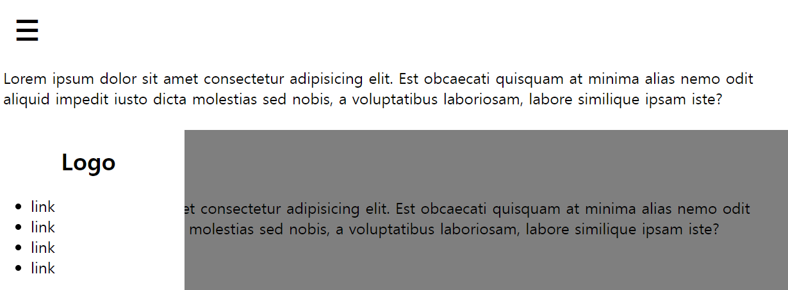
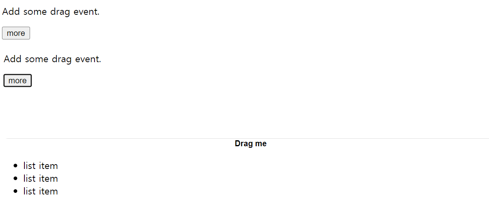
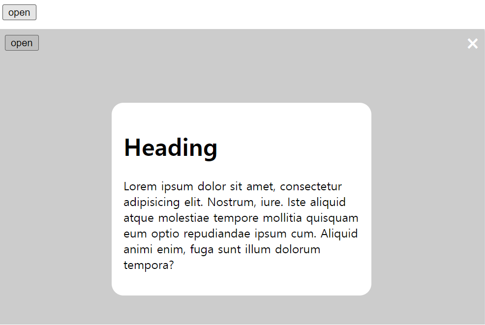
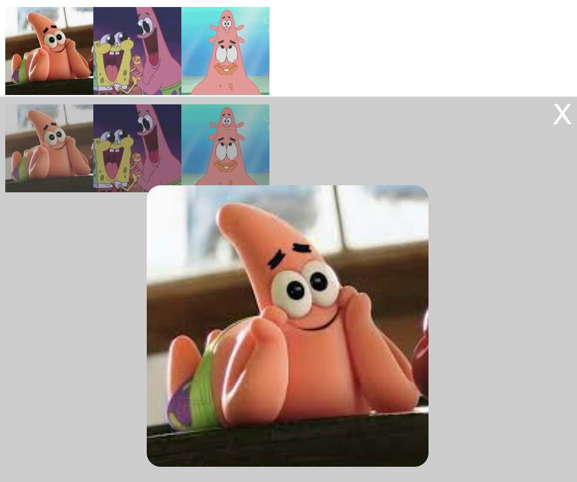
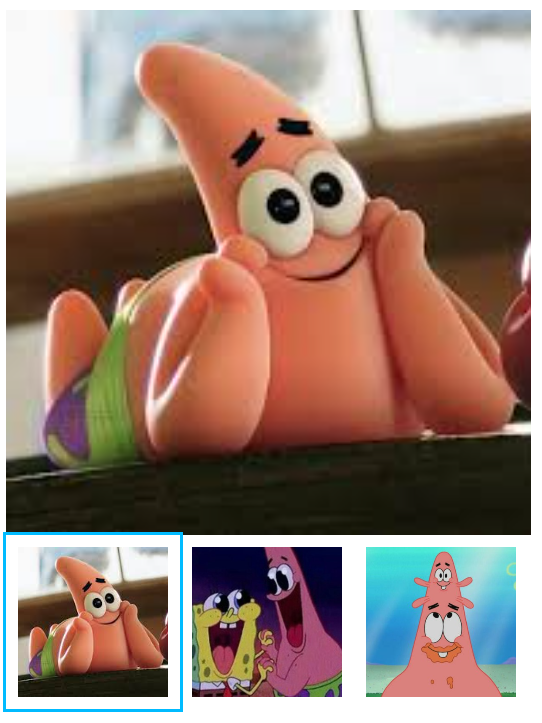
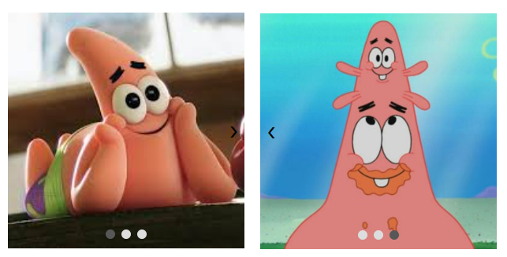

<br> 
<h1>JavaScript</h1>
<br>

#9  
예제 

<br>


<h1> Side Bar </h1>

```html
<style>
  #btn {
      font-weight: bold;
      font-size: 30px;
      border: none;
      width: 50px;
      height: 50px;
      background-color: white;
  }
  .hidden {
      display: none;
  }
  ul li a {
      text-decoration: none;
      color: #000;
  }
  ul li a:hover {
      color: #ddd;
  }
  #list {
      top: 0;
      left: 0;
      position: fixed;
      background-color: #fff;
      width: 200px;
      height: 100%;
      transition: 0.2s;
      z-index: 1;
  }
  #overlay {
      position: fixed;
      top: 0;
      right: 0;
      bottom: 0;
      left: 0;
      background-color: rgba(0 0 0/ 0.5);
  }
</style>

<button id="btn">&#9776;</button>
<nav id="list" class="hidden">
  <h1 style="text-align: center;">Logo</h1>
  <ul>
      <li><a href="#"> link </a></li>
      <li><a href="#"> link </a></li>
      <li><a href="#"> link </a></li>
      <li><a href="#"> link </a></li>
  </ul>
</nav>

<div id="overlay" class="hidden"></div>

<main>
  <p>Lorem ipsum dolor sit amet consectetur adipisicing elit. Est obcaecati quisquam at minima alias nemo odit
      aliquid impedit iusto dicta molestias sed nobis, a voluptatibus laboriosam, labore similique ipsam iste?</p>
</main>

<script>

  var btn = document.getElementById('btn');
  var list = document.getElementById('list');
  var overlay = document.getElementById('overlay');

  btn.addEventListener('click', (e) => {
      console.log(e);
      list.classList.remove('hidden');
      overlay.classList.remove('hidden');
  })
  overlay.addEventListener('click', (e) => {
      if (e.target !== btn) {
          list.classList.add('hidden');
          overlay.classList.add('hidden');
      }
  })
</script>
```


<br><br>

<h1>Drawer</h1>

```html
<style>

#nav{
    left: 0;
    width: 100%;
    height: 100%;
    top: 100vh;
    position: fixed;
    border: 1px solid #ddd;
    border-radius: 1rem 1rem 0 0;
    transition: top 0.5s;
    box-sizing: border-box;
    /* viewport 높이의 100% = 100vh / vh 는 보이는 화면 기준*/
}
#drawer{
    background-color: #fff;
    border: none;
    width: 100%;
    cursor: grab;
}

</style>

    <p>Add some drag event.</p>

    <button id="more">more</button>

    <nav id="nav" class="hidden">
        <button id="drawer" style="text-align: center; font-weight: bold;">Drag me</button>
        <ul>
            <li>list item</li>
            <li>list item</li>
            <li>list item</li>
        </ul>
    </nav>
    <script>
        var btn = document.getElementById('more');
        var nav = document.getElementById('nav');
        var drawer = document.getElementById('drawer');
        var TOP;
        btn.addEventListener('click', (e) => {
            nav.style.top = '20vh';
        })

        // touch 이벤트는 모바일 이벤트임
        drawer.addEventListener('touchmove', (e) => {

            // 뷰 포트 탑과 엘리먼트 탑(손가락)의 거리
            var clientY = e.touches[0].clientY;

            // innerHeight = 뷰포트의 높이
            TOP = clientY / window.innerHeight * 100; // 화면 전체 백분율로 나타냄
            console.log(TOP)
            nav.style.top = TOP + 'vh';
        })
        drawer.addEventListener('touchend', (e) => {
            // ...
            console.log('터치 끝')
            if (TOP > 50) { // Draw가 화면 절반 아래로 내려온 경우
                nav.style.top = '100vh';
            } else {
                nav.style.top = '20vh';
            }
        })

    </script>
```


<br><br>


<h1> Modal</h1>

```html
<style>
  .hidden {
      display: none;
  }

  #overlay {
      position: fixed;
      left: 0;
      top: 0;
      width: 100%;
      height: 100%;
      background-color: rgba(0, 0, 0, 0.2);
  }

  #modal {
      max-width: 20rem;
      margin: 100px auto;
      /* 마진  위, 왼 */
      background-color: #fff;
      padding: 1rem;
      border-radius: 1rem;
  }

  #close {
      float: right;
      background-color: transparent;
      border: none;
      color: #fff;
      font-size: 2rem;
  }
</style>

<button id="open"> open </button>

<div id="overlay" class="hidden">
  <button id="close">&times;</button>
  <div id="modal">

      <h1> Heading</h1>
      <p>Lorem ipsum dolor sit amet, consectetur adipisicing elit. Nostrum, iure. Iste aliquid atque molestiae
          tempore mollitia quisquam eum optio repudiandae ipsum cum. Aliquid animi enim, fuga sunt illum dolorum
          tempora?</p>
  </div>
</div>

<script>
  var closeBtn = document.getElementById('close');
  var openBtn = document.getElementById('open');
  var overlay = document.getElementById('overlay');

  openBtn.addEventListener('click', (e) => {
      overlay.classList.remove('hidden');
  })

  // overlay 클릭하는 범위 감지
  overlay.addEventListener('click', (e) => {
      
      // e.target 클릭한 범위
      if (e.target == overlay) {
        overlay.classList.add('hidden');
        console.log(overlay);
      }

      if (e.target == closeBtn) {
        overlay.classList.add('hidden');
        console.log(closeBtn);
      }
  })
</script>
```


<br><br>

<h1>Modal Gallery</h1>

```html
<style>
  .con {
      display: flex;
  }
  .main_img {
      width: 100px;
      height: 100px;
      object-fit: cover;
      opacity: 0.8;
  }
  .main_img:hover {
      opacity: 1;
  }
  .hidden {
      display: none;
  }
  #overlay {
      position: fixed;
      top: 0;
      left: 0;
      background-color: rgba(0, 0, 0, 0.2);
      width: 100%;
      height: 100%;
      z-index: 1;
  }
  #modal_img {
      width: 20rem;
      height: 20rem;
      object-fit: cover;
      display: block;
      margin: 100px auto 0;
      border-radius: 1rem;
  }
  #btn{
      float: right;
      border: none;
      background-color: transparent;
      color: #fff;
      font-size: 2rem;
  }
</style>

<div id="overlay" class="hidden" >
  <button id="btn">X</button>
  
</div>

<div class="con">
  
  
  
</div>


<script>

  var img = document.getElementsByClassName('main_img'); // 이미지
  var overlay = document.getElementById('overlay'); // 오버레이
  var closeBtn = document.getElementById('btn'); // 오버레이 안 X 버튼
  var modal_img = document.getElementById('modal_img'); // 모달 내 이미지

  for (var i=0; i {
          overlay.classList.remove('hidden')
          modal_img.src = e.target.src;
          // img 받아온 정보가 e 타겟에 들어있고 그 scr을 대입함.
      })
  }
  // overlay 이벤트ㅁ 감지의 범위
  overlay.addEventListener('click', (e) => {
      if (e.target === overlay) {
          overlay.classList.add('hidden')
      }
      if (e.target === closeBtn) {
          overlay.classList.add('hidden')
      }
  })

</script>
```


<br><br>

<h1>Gallery</h1>

```html
<style>
    .con{
        display: flex;
    }
    .main_img{
        padding: 0.5rem;
        width: 100px;
        height: 100px;
        object-fit: cover;
    }
    #big_img{
        width: 350px;
        height: 350px;
        object-fit: cover;
    }
    .active{
        outline: 2px solid #0bf;
    }
</style>

<div>
    
</div>

<div class="con">
  
  
  
</div>

<script>

  var main_img = document.getElementsByClassName('main_img')
  var big_img = document.getElementById('big_img')

  var previousIndex = 0;
  
  function jumpTo(thisIndex){
      if (previousIndex === thisIndex){
          return;
      }
      main_img[thisIndex].classList.add('active');
      // 이벤트 타깃에 선 추가
      main_img[previousIndex].classList.remove('active');
      // 전에 있던 이벤트 타깃에 보더 삭제

      big_img.src = main_img[thisIndex].src;
      // 사진 둘 다 같게 만들어주기

      previousIndex = thisIndex;
      // 이전 인덱스값 구하기 ( 이전 인덱스 값의 현재 인덱스 저장해주면
      //  다음에 받는 현재 인덱스 값이 이전 인택스 값 알 수 있음)
  }

</script>
```


<br><br>

<h1>Carousel</h1>

```html
 <style>

    #con {
        width: 600px;
        height: 200px;
        display: inline-flex;
        transition: 0.2s;
        /* 가로 600으로 이미지 ㅇㅇㅇ 이렇게 배치해서
        출력시 하나만 보이게하고 translateX 로 보이는 위치만
        바꿔서 다음 사진으로 출력하게 해줌 */
    }
    .all {
        width: 200px;
        height: 200px;
        position: relative;
        overflow: hidden;
    }
    .main_img {
        width: 200px;
        height: 200px;
        object-fit: cover;
        transition: 0.2s;
    }
    .hidden {
        visibility: hidden;
    }

    /* button */
    #prev,
    #next {
        position: absolute;
        height: 100%;
        display: flex;
        align-items: center;
        background-color: transparent;
        border: none;
    }
    #prev {
        top: 0;
        left: 0;
    }
    #next {
        top: 0;
        right: 0;
    }

    /* dot */
    .indicator {
        position: absolute;
        bottom: 0.25rem;
        width: 100%;
        text-align: center;
    }

    .dot {
        display: inline-block;
        width: 0.5rem;
        height: 0.5rem;
        border-radius: 50%;
        background-color: #ddd;
    }

    .active {
        background-color: #575757;
    }
</style>

<h1>Carousel</h1>

<div class="all">

    <div id="con">
        
        
        
    </div>

    <button id="prev" class="hidden" onclick="navigateTo(-1)">&#10094;</button>
    <button id="next" onclick="navigateTo(1)">&#10095;</button>

    <div class="indicator">
        <span class="dot active"></span>
        <span class="dot"></span>
        <span class="dot"></span>
    </div>
</div>

<script>

    var prev = document.getElementById('prev');
    var next = document.getElementById('next');
    var dot = document.getElementsByClassName('dot');
    var con = document.getElementById('con');
    var thisIndex = 0;
    var previousIndex = 0;
    var imageWidth = 200;

  function navigateTo(data) {

      thisIndex += data;
      // 입력 값 받아와서 저장하기

      console.log(thisIndex);

      // 이미지 움직이기
      con.style.transform = `translateX(-${thisIndex * imageWidth}px)`;
      // translateX("-" + (thisIndex * imageWidth) + "px") 위의 식과 같은 의미

      // 버튼 토글
      if (thisIndex === 0) { // 첫번째 이미지에 있는 경우
          prev.classList.add('hidden');
      } else {
          prev.classList.remove('hidden');
      }

      if (thisIndex === 2) { // 마지막 이미지 일때
          next.classList.add('hidden');
      } else {
          next.classList.remove('hidden');
      }

      // indicator
      dot[thisIndex].classList.add('active');
      dot[previousIndex].classList.remove('active');


      // 이전 인덱스값 구하기 ( 이전 인덱스 값의 현재 인덱스 저장해주면
      //  다음에 받는 현재 인덱스 값이 이전 인택스 값 알 수 있음)
      previousIndex = thisIndex;


  }

</script>
```


<br>

<h6> 4/5, 4/10 수업, 4/15 복습 정리</h6>

<br>
